# ExamPortal

# Contents
-  About the Software	
-  Software Design	
-  Software Optimizations	
-  Software Diagrams	
-  Flow of Control	
-  Entity Relationship Diagram	
-  Database Design	
-  Relationships Among Table within Database	
-  Demonstration Images of the Software
-  Admin Profile	
-  Registration Page	
-  Login Page	
-  Welcome Page of Admin-Side	
-  Viewing Your Profile Details	
-  Adding a Subject	
-  Viewing Created Subjects	
-  Deleting a Created Subject	
-  Adding a Quiz	
-  Adding Questions to a Quiz	
-  Viewing Created Quizzes	
-  Updating Quiz Information	
-  Viewing the Result for a Quiz as a Professor	
-  Student Profile	
-  View All Quizzes	
-  View Quizzes of a Particular Subject	
-  Starting a Quiz	
-  Viewing the Result for a Quiz	

# About the Software

Examportal is a software that provides professors a user-friendly platform to host quizzes for all of their courses while ensuring that these quizzes are answered by students in an ethical manner.

There are 2 types of profiles that are available in Examportal

- Admin – to be used by the Professor
- Student

Users working on the Admin Profile have the following functionalities available to them:

- Create Courses
- Modify Courses
- Delete Courses
- Create Quizzes
- Modify Quizzes
- Delete Quizzes
- Enable Tab Switch Prevention
- Create Questions
- View Student-Wise Test Results

Users working on the Student Profile have the following functionalities available to them:

- Attempt Quizzes
- Review Quizzes
# Software Design

This software was developed using

- Angular – Frontend
- SpringBoot – Backend
- MySQL – Database Management
## Software Optimizations
- Authentication is quick and secure with JWT Authentication.
- Use of Single Webpages ensures faster load times.
- Use of a widely-used open-source editor results in the ability for the professor to add questions of various media types, enhancing the breadth of usability of the software and ensuring wider inclusivity.
- Usage of automatic submission benefits both profiles of users as work is always saved.

# Software Diagrams

## Flow of Control

## Entity Relationship Diagram

# Database Design

Tables in Database

Table - User

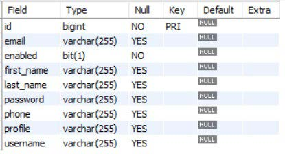

Table - Role

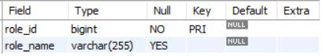

Table - User\_Role

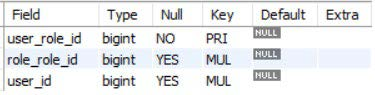

Table - Category

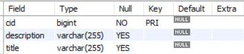

Table - Quiz

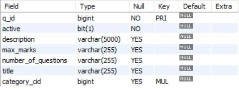

Table - Question

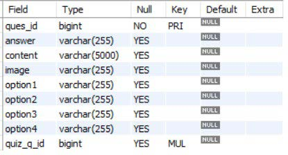

## Relationships Among Table within Database

# Demonstration Images of the Software

## Admin Profile

### Registration Page
- Users: All who are not registered with Exam Dojo
- Users are required to enter a valid:
  - Username
  - Password
  - First Name
  - Last Name
  - Email
  - Phone Number
- All entries are validated and appropriate errors will be given
- Accounts are authenticated using JWT Authentication
- 

### Login Page
- Users: All who are registered with Exam Dojo
- Users are required to enter a valid:
  - Username
  - Password
  - First Name
  - Last Name
  - Email
  - Phone Number
- All entries are validated and appropriate errors will be given
- Accounts are authenticated using JWT Authentication

### Welcome Page of Admin-Side
- Users: Professors or anyone who has logged in with an Admin Profile

### Viewing Your Profile Details
- Users: Professors or anyone who has logged in with an Admin Profile
- How to Get Here: Click on the ‘*Profile*’ button from the menu on the left

### Adding a Subject
- Users: Professors or anyone who has logged in with an Admin Profile
- How to Get Here: 
  - Click on the ‘*Add Subject*’ button from the menu on the left
  - Click on ‘*Add New Subject*’ below the created subjects within the ‘*Subjects*’ sub-menu
- What you have to enter:
  - Name of the subject
  - Description of the subject

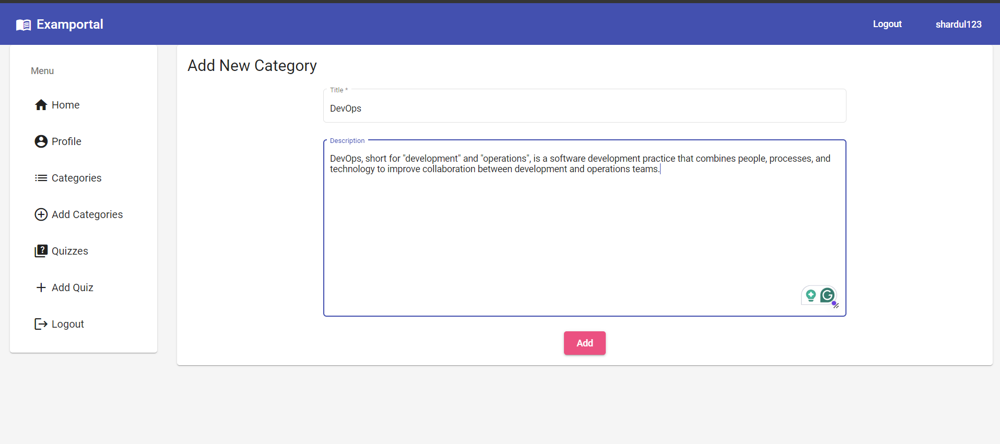

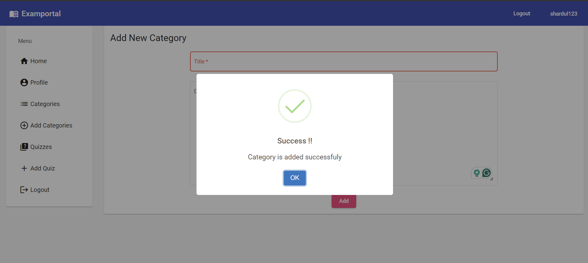

### Viewing Created Subjects
- Users: Professors or anyone who has logged in with an Admin Profile
- How to Get Here: Click on the ‘*Subjects*’ button from the menu on the left

### Adding a Quiz
- Users: Professors or anyone who has logged in with an Admin Profile
- How to Get Here: Click on the ‘*Add Quiz*’ button from the menu on the left
- What you have to enter:
  - Name of the Quiz
  - Description of the Quiz
  - Maximum Marks for the Quiz
  - Number of Questions to be asked
  - Subject that the quiz is part of
  - ‘Publish Status’ toggle will control whether the student is able to view the quiz on their profile

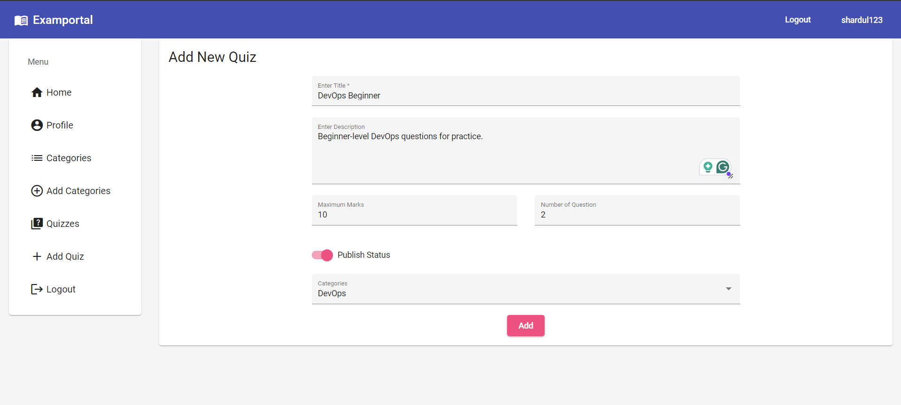
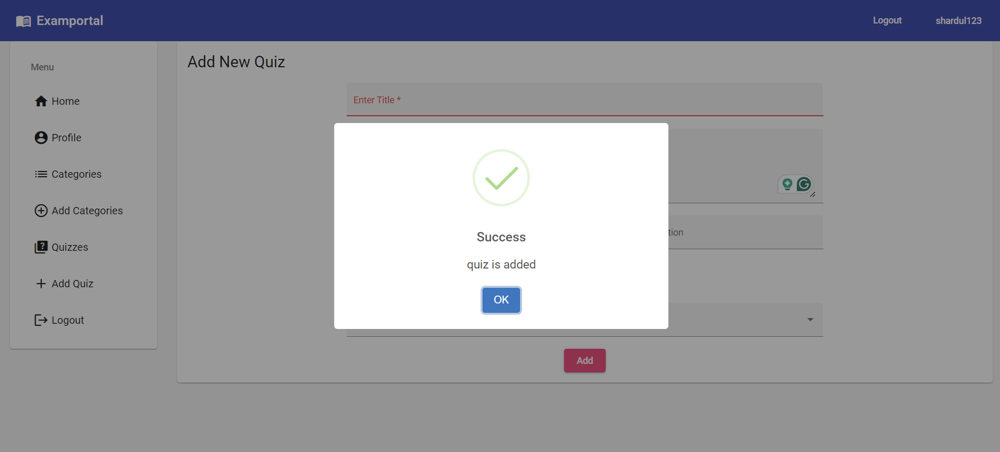
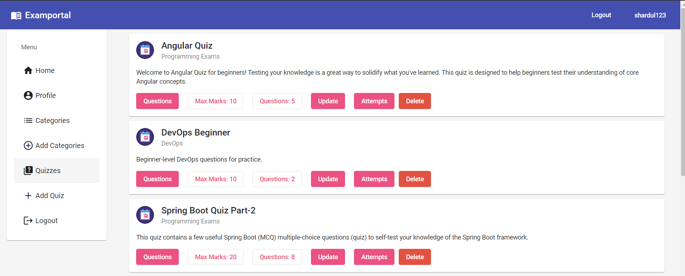

### Adding Questions to a Quiz
- Users: Professors or anyone who has logged in with an Admin Profile
- How to Get Here: Click on the ‘Questions’ button from the row of buttons below the name of a created quiz within the Quizzes Page
- How to Create Your First Question:
  - After clicking on the ‘Questions’ button, click on ‘Add Question’ Button
  - Enter your question in the text field given
    - Questions can be formatted with different font styles, equations, colors, hyperlinks or images with the use of the ribbon of formatting options on the top border of the text filed
  - Enter the four options you would like the student to choose from
  - Select the correct answer from the dropdown list
    - The correct answer must be one of the options
  - Click on ‘*Add*’ button at the bottom of the page
  - You have successfully created a question
  - If you would like to start afresh, you can clear the question and associated option with the ‘*Clear*’ button at the bottom of the page before clicking on the ‘Add’ button
  - Repeat this process to add further questions
- Questions can be updated after adding by clicking on the ‘*Update*’ button within the ‘*Questions*’ *Page*

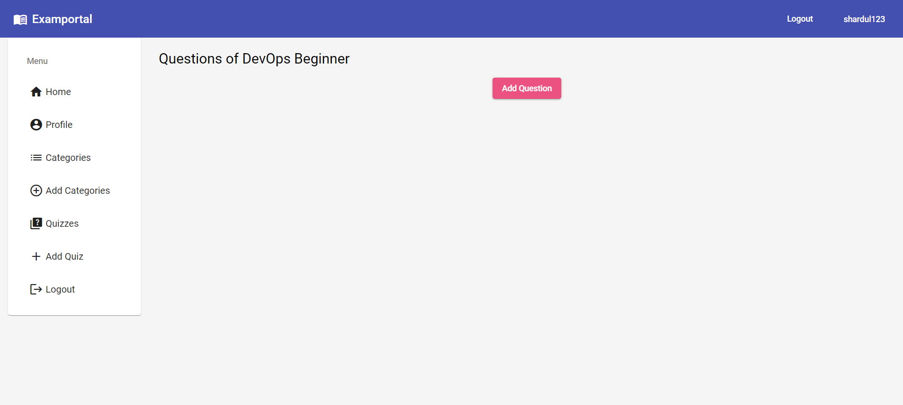
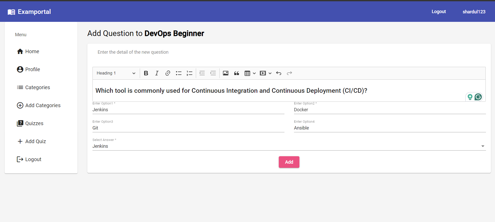

##

### Viewing Created Quizzes
- Users: Professors or anyone who has logged in with an Admin Profile
- How to Get Here: Click on the ‘*Quizzes*’ button from the menu on the left

### Updating Quiz Information
- Users: Professors or anyone who has logged in with an Admin Profile
- How to Get Here: Click on the ‘*Update*’ button from the row of buttons below the name of a created quiz within the Quizzes Page

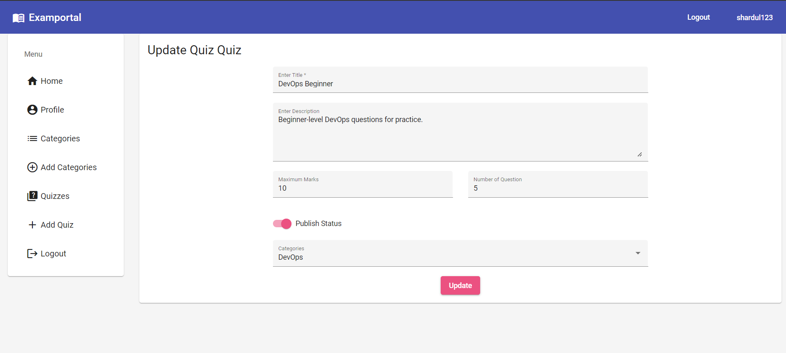

## Student Profile

### View All Quizzes
- Users: Students
- How to Get Here: Click on the ‘*All Quizzes*’ button from the menu on the left

### View Quizzes of a Particular Category
- Users: Students
- How to Get Here: Click on the subject name button from the menu on the left. For example, if you would like to view the quizzes available in the catergory, “*Programming Exams*”, click on the button, “*Programming Exams*”

### Starting a Quiz
- Users: Students
- How to Get Here: Click on the “*Start*” button below the quiz name
- Instructions for attempting the quiz will be shown on starting the quiz
- To start answering questions, click on the “*Start Quiz*” button from the instructions page

- A confirmation pop-up will be displayed to start the quiz.
- Click on the “*Start*” button to start. Else, click on the “*No*” button

- It is to be noted that the quiz will Auto Submit when the timer on the right side of the screen reaches 0

- The quiz will auto submit will submit automatically if tab is switched to ensure ethical attempts of the quiz
- On submission, the results of the quiz are shown as a summary

